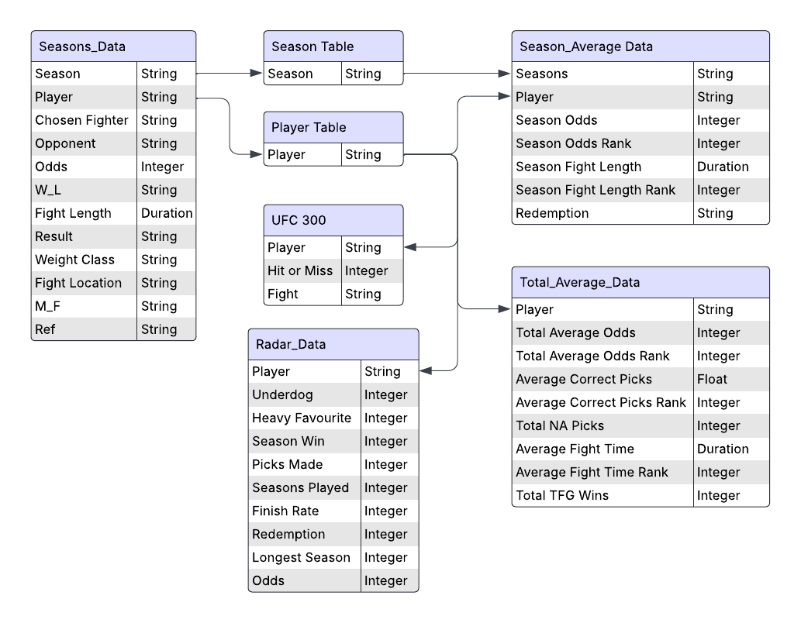

# The Fight Game

### Table of Contents
- [Executive Summary](#executive-summary)
- [Key Findings and Insights](#key-findings-and-insights)
- [Methodology](#methodology)
- [Future Work](#future-work) 

***
### Project Background
The Fight Game focuses on analyzing the data, a game created by a group of friends, containing over 6000 data points across 10 seasons, and continues to grow. The goal is to provide insights into player behaviour, such as picking heavy favourites or parlay hit rates, and make data-driven conclusions on how to classify a player. The game serves as a fun, competitive platform for the group. Therefore, understanding the player behaviour patterns can help improve game balance, inform future development decisions, and potentially identify player archetypes or successful strategies within the game's context.

***

### Executive Summary
This analysis explores patterns in player decision-making within The Fight Game across 10 seasons and 6,000+ data points, revealing distinct player archetypes, varied risk appetites, and evolving trends in game engagement. These insights can be directly leveraged to enhance competitiveness through adaptive challenges and balanced fighter selections. Furthermore, understanding behavioural and engagement trends enables prioritizing updates and new features that resonate with players, implementing targeted in-game events, and personalizing reward systems. Ultimately, these findings support data-driven enhancements to The Fight Game, fostering player satisfaction, increasing competitive balance, and strategically guiding future game development.

The Fight Game ERD
***

### Key Findings and Insights
In "The Fight Game," relying on a strategy of consistently picking heavy favourites (odds of -300 or better) each week does not guarantee success, as even the strongest fighters can fall at any moment due to the unpredictable nature of combat sports; conversely, opting for underdogs carries comparable risks due to their lower likelihood of winning. Achieving consistency in decision-making proves to be a significant challenge, as player performance can fluctuate based on varying fight dynamics and unpredictable outcomes. Additionally, main card fights tend to be more difficult to predict compared to prelim or early prelim bouts, likely due to the higher calibre of competition and increased scrutiny on main card matchups. These insights suggest that a balanced and adaptable approach to fighter selection, rather than rigid adherence to a single strategy, may be more effective in navigating the complexities of the game.

***

### Methodology
* **Data Collection**: The entire "The Fight Game" Instagram chat log was exported as a JSON file. All content unrelated to The Fight Game was systematically removed to ensure data relevance and integrity. Each player's pick was manually cross-referenced with Tapology.com to verify accuracy, and the consolidated data was organized and enriched within an Excel spreadsheet.

* **Data Cleaning**: The Excel file was exported as a CSV and imported into Python for further processing. Custom scripts (Extract_Player_Data.py, Export_Seasons_Data.py, Export_Average_Season_Data.py, Export_Average_Data.py, and Radar_Data.py) were employed to merge data from all ten seasons, standardize formats, and generate detailed data tables structured for analysis.

 * **Designing**: Developed user interface prototypes and data visualization concepts using Figma to optimize the presentation of insights derived from the analysis. Iteratively refined dashboard layouts, color schemes, and interactive elements based on usability principles and stakeholder feedback, ensuring that final visualizations were both intuitive and visually engaging.

 * **Data Visualization**: Cleaned and aggregated datasets were imported into Power BI to develop interactive dashboards and visual reports. These visualizations enabled direct comparison of player performance across seasons, identification of emerging engagement trends, and clear illustration of player archetype distributions—delivering actionable insights to key stakeholders.

* **Pilot Testing and Analysis**: Conducted a pilot test on the visualization to assess the potential impact of proposed game rule changes and features. The pilot test aimed to ensure that the visualization effectively communicated the story behind each player, provided actionable insights, and supported decision-making for refining the game and enhancing the overall user experience before full implementation.

***

### Future Work
As part of the ongoing development of "The Fight Game" analysis, I aim to establish a centralized database, such as SQLite or PostgreSQL, to automate data management and eliminate the need to manually run Python scripts at the end of each season, enabling real-time updates through automated ingestion of Instagram chat logs and fight outcomes. This will create a seamless pipeline where new data is instantly reflected in Power BI dashboards, ensuring stakeholders have the latest insights with minimal effort. Additionally, to boost player engagement, I plan to introduce personalized trophies for achieving milestones like successful picks or high parlay hit rates, tracked automatically via the database. These digital badges or group recognitions will foster a sense of achievement and friendly competition, enhancing the gaming experience.

***

This project was developed to analyze and enhance The Fight Game experience for our group of friends. For questions or collaboration opportunities, please reach out.